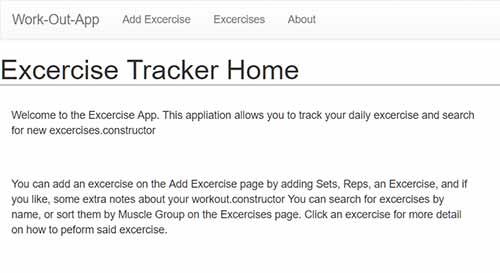
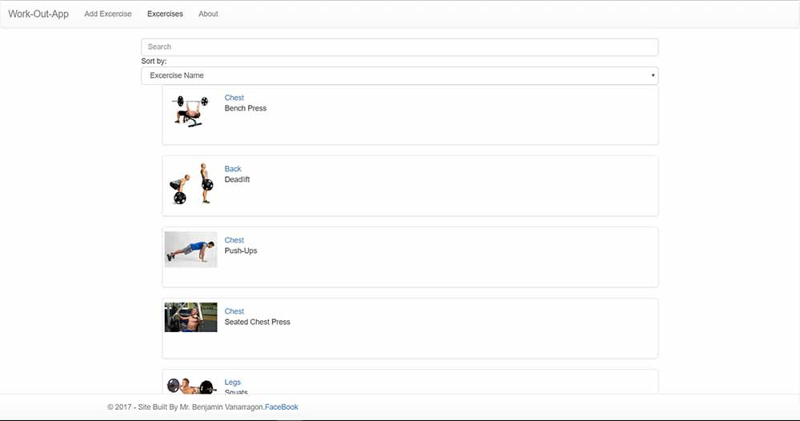
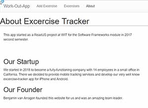

# Assignment 1 - ReactJS app.

Name: ... Benjamin Vanarragon ...

## Overview.
...... This app is designed to be a productivity application where users can store their Excercises and work-outs. They are able to add a number of reps and sets for which excercise they did and some additional notes. Users can edit their work-outs as well.Users can also delete a work-out if they don't want that excercise appearing anymore on their dashboard for whatever reason. Users can search a database of excercises in the application, sort by text, or by muscle-group. They can click an item for further information on how to perform the excercise.  ........

 . . . . . List of user features  . . . . 
 
 + Add an Excercise
 + Edit an Excercise
 + Delete an Excercise
 + Search an Excercise
 + Sort an Excercise
 + Expand an Excercise for more detail

## Installation requirements.
. . . .  List of software used to develop the app . . . . . . . 
+ ReactJS v15.3.0
+ Bootstrap 3
+ create-react-app tool
+ Node JS v6.0.0
 

. . . . . . npm install + npm start

## Data Model Design.

Diagram of app's data model (see example below) AND/OR a sample of the test data used (JSON or equivalent).

![][image1]

Use meaningful sample data. Briefly explain any non-trivial issues.

## App Component Design.

A diagram showing the app's hierarchical component design (see example below). 

![][image2]

## UI Design.

. . . . . Screenshots of app's views (see example below) with appropriate captions . . . . . . . 

## Routing.
. . . . List each route supported and state the associated view . . . . . 

+ / - displays home page
+ /addExcercise - allows users to add/edit/delete and excercise
+ /excercises - allows users to search/sort excercises
+ /excercises/:id - detail view of a particular foo (:id)
+ /about - provides an about page for the application

## Extra features

. . . . . Users can sort by muscle group, sort by text entered, edit an excercise in the form . . . . . .  

## Independent learning.

. . . . . I learned a lot about ReactJS in this time. The way components worked with parents and children, the way the data flows throughout the application. I learned trivial things, for example for being able to type in a textbox you must have a method handler to handle the text changing and to update it  . . . . .  

[image1]: ./model.png
[image2]: ./design.jpg
